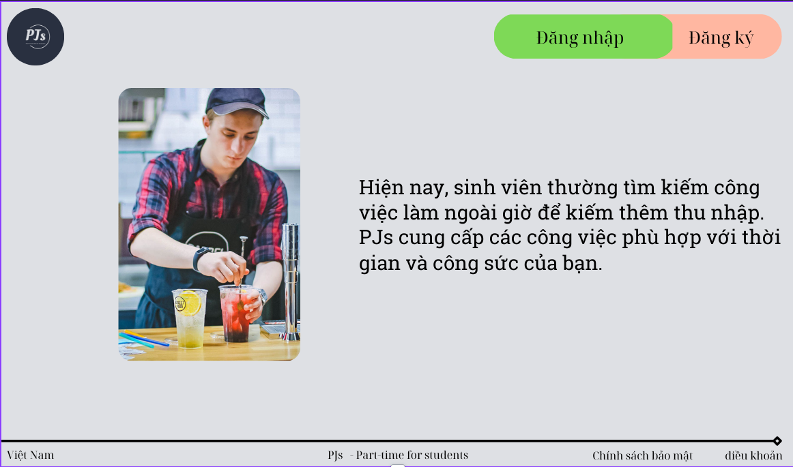
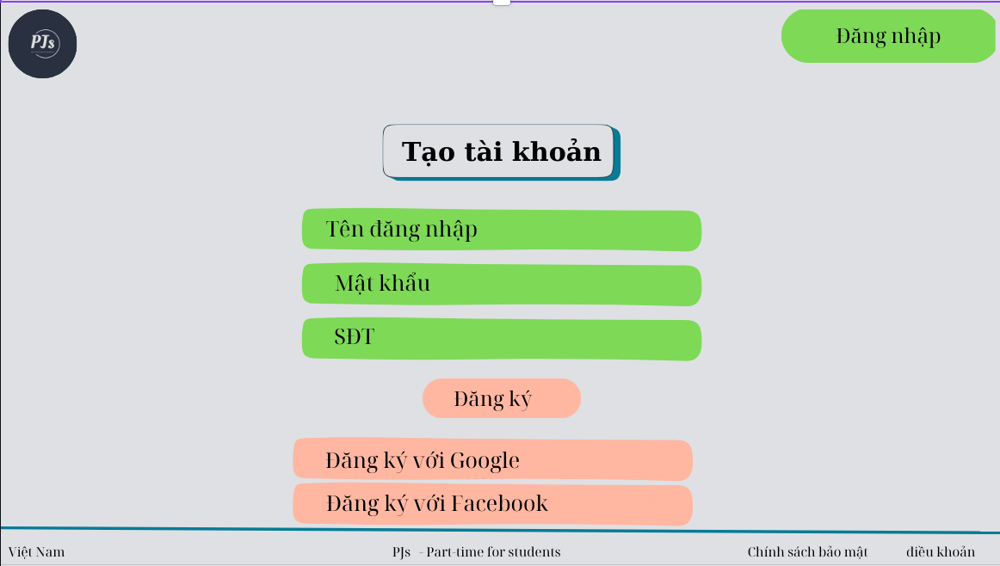

# Tại sao lựa chọn ý tưởng: <u>Trang web hỗ trợ tìm kiếm việc thêm cho sinh viên</u>?

###### Thời gian: <u>2024-11-30 21:24</u>

<strong>Lưu ý: </strong>
Bài viết có thể vẫn còn nhiều thiếu sót nhưng yêu cầu các bạn đọc hết để có thể hiểu ý tưởng của mình và cùng thực bài nghiên cứu khoa học.

## I. Mở đầu

### 1. <u>Lý do lựa chọn đề tài:</u>

-- Đúng với lĩnh vực của ngành Công nghệ thông tin.  
-- Nhìn thấy thực trạng tìm kiếm công việc khá khó khăn của sinh:

- Phải tự đi tìm trên các trang mạng xã hội:
  - Tốn thời gian;
  - Tốn công sức;
- Những bài tìm tuyển thường dễ bị trôi -> bỏ lỡ cơ hội.
- Truyền từ người này sang người khác:
  - Tốn thời gian;
  - Truyền qua thường là người quen nên người ngoài dễ mất cơ hội;
- Không tìm thấy công việc phù hợp.

-- Sinh viên thời điểm hiện tại rất năng động:

- Mong muốn tự lập, không quá phụ thuộc vào giao đình;
- Mong muốn có thu nhập để có thể trang trải cho các hoạt động cá nhân;
- Gia đình khó khăn nên phải tự lo cho bản thân;

### 2. <u>Đối tượng và phạm vi nghiên cứu:</u>

-- Phạm vi:

- Phạm vi nhỏ: trong lớp 46CNTT2.

-- Đối tượng:

- Đối tượng: Tất cả mọi người, tập trung vào sinh viên.

### 3. <u>Mục đích nghiên cứu của dự án:</u>

- Sinh viên dễ dàng tìm kiếm công việc phù hợp với bản thân.
- Giúp cho các bên tuyển dụng dễ dàng tìm kiếm được người phù hợp.
- Giúp cho 2 bên dễ liên lạc.
- Sinh viên không bị bỏ lỡ bài đăng của bên tuyển dụng:
  - Bài tìm việc không bị trôi vì hoàn toàn tâp trung vào việc tìm kiếm công việc chứ không hề liên quan đến việc giải trí;
- Người tìm công việc cũng sẽ dễ dàng để biết được số lượng người đang cần tuyển dụng và khi đăng ký cũng biết được còn lại bao nhiêu suất.
- Liên kết các bên tuyển công việc để sinh viên dễ dàng hơn trong tìm kiếm việc làm.

> #### => MỤC ĐÍCH CUỐI CÙNG: Giúp cho việc tìm kiếm việc làm thêm trở nên dễ dàng (Sinh viên không phải đối tượng duy nhất tuy nhiên là đối tượng hướng tới hiện tại).

### 4. <u>Phương pháp nghiên cứu:</u>

- Xây dựng một bản thô của trang web (giao diện - không sử dụng được).
- Tìm kiếm thông tin về thực trạng sinh viên khó khăn trong việc tìm kiếm việc làm thêm.
- Thực hiện khảo sát sinh viên:

  - Sinh viên đang đi làm;
  - Sinh viên chưa đi làm và mong muốn đi làm;

### 5. <u>Ý nghĩa khoa học và giá trị thực tiễn của đề tài:</u> (Đang thêm...)

---

## II. Nội dung

- Xây dựng biểu đồ
- Hình ảnh
- v.v...

---

## III. BẢN THÔ CỦA TRANG WEB

### Tên trang web: PJs (Part-time Jobs)

### <u>Logo</u>

#### <u>Màn hình giới thiệu</u>

#### <u>Màn hình đăng ký</u>

#### <u>Màn hình đăng nhập</u>

`Lưu ý: đây chỉ là nhũng bản thô được tạo ra bằng Canva, chưa phải sản phâm rồi hoàn thiện.`

---

Nội dung bài viết được xây dựng bởi <u>Mùa A Giống</u>

